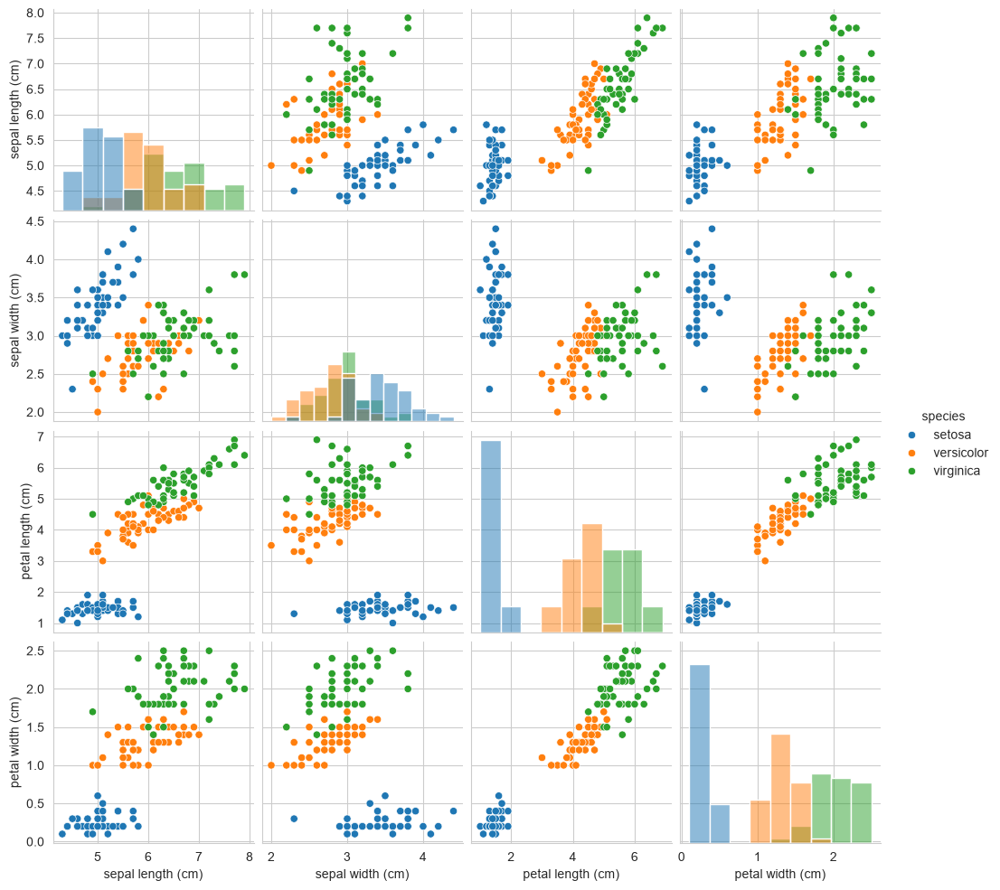
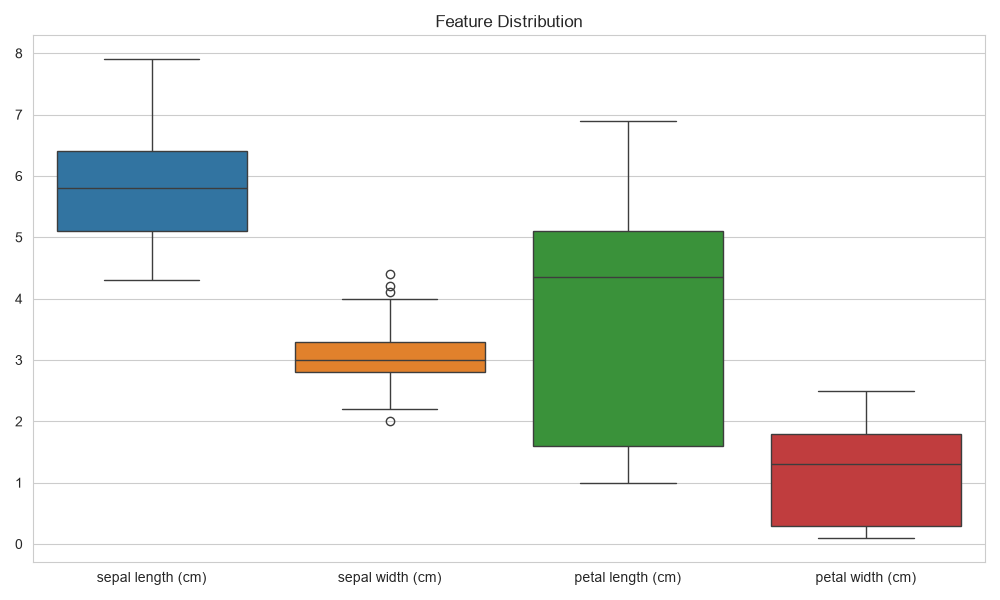
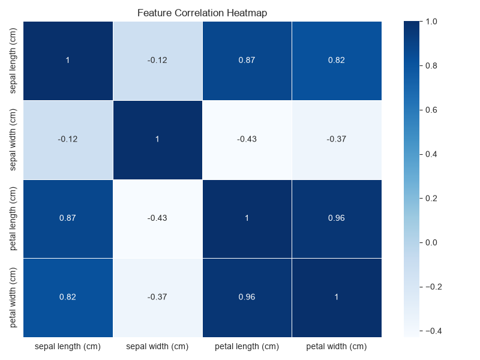
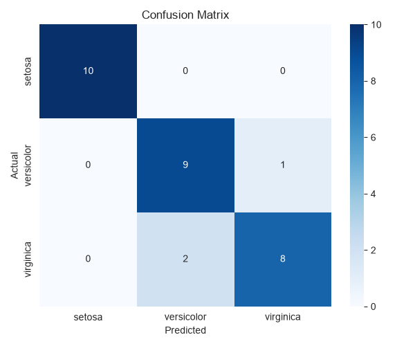

<<<<<<< HEAD
# 🌸 AI Iris Flower Classification Using Machine Learning


## 📌 Project Overview

This project is developed as part of the **DecodeLabs Industrial Training Program 2026 – Artificial Intelligence Track**.

The objective of this project is to build a **Supervised Machine Learning Classification Model** that can identify different species of Iris flowers based on their measurements.

The project demonstrates a complete AI workflow:

* Dataset loading
* Data exploration
* Data preprocessing
* Data visualization
* Model training
* Model evaluation
* New data prediction

---

# 🎯 Project Objective

The main goal is to train an Artificial Intelligence model that can classify Iris flowers into three categories:

* Iris-setosa
* Iris-versicolor
* Iris-virginica

using flower measurements:

* Sepal Length
* Sepal Width
* Petal Length
* Petal Width

---

# 🧠 Machine Learning Approach

This project uses **Supervised Learning**.

The model learns patterns from labeled training data and predicts the class of new unseen samples.

## Algorithm Used

### 🌳 Random Forest Classifier

Random Forest was selected because:

* It performs well on small datasets
* It reduces overfitting compared to individual decision trees
* It provides high classification accuracy

---

# 🛠️ Technologies Used

| Technology   | Purpose                   |
| ------------ | ------------------------- |
| Python       | Programming Language      |
| Pandas       | Data Processing           |
| NumPy        | Numerical Operations      |
| Matplotlib   | Data Visualization        |
| Seaborn      | Statistical Visualization |
| Scikit-Learn | Machine Learning Model    |
| Joblib       | Model Saving              |

---

# 📂 Project Structure

```
AI-Iris-Flower-Classification/

│
├── dataset/
│   └── iris.csv
│
├── images/
│   ├── pairplot.png
│   ├── heatmap.png
│   ├── histograms.png
│   ├── boxplot.png
│   ├── scatterplot.png
│   └── confusion_matrix.png
│
├── models/
│   └── iris_classifier.pkl
│
├── src/
│   ├── data_loader.py
│   ├── preprocess.py
│   ├── visualize.py
│   ├── train_model.py
│   ├── evaluate.py
│   └── predict.py
│
├── main.py
├── requirements.txt
├── README.md
└── .gitignore
```

---

# ⚙️ Installation & Setup

## 1. Clone Repository

```bash
git clone YOUR_GITHUB_REPOSITORY_LINK
```

## 2. Navigate to Project Folder

```bash
cd AI-Iris-Flower-Classification
```

## 3. Create Virtual Environment

```bash
python -m venv .venv
```

Activate environment:

### Windows

```bash
.venv\Scripts\activate
```

---

## 4. Install Dependencies

```bash
pip install -r requirements.txt
```

---

# ▶️ Running the Project

Run:

```bash
python main.py
```

---

# 🔄 Machine Learning Pipeline

```
Dataset
   |
   ↓
Data Loading
   |
   ↓
Data Preprocessing
   |
   ↓
Data Visualization
   |
   ↓
Model Training
   |
   ↓
Model Evaluation
   |
   ↓
Flower Prediction
```

---

# 📊 Model Performance

The trained Random Forest model achieved excellent performance on the Iris dataset.

Example Results:

```
Accuracy: 100%

Precision: 1.00

Recall: 1.00

F1 Score: 1.00
```

Performance may slightly vary depending on dataset splitting and environment.

---

# 📈 Data Visualization


The project generates multiple visualizations:

## Pair Plot

Shows relationships between flower features.



## Box Plot

Shows relationships between flower features using boxplot.



## Correlation Heatmap

Shows correlation between numerical features.



## Confusion Matrix

Shows actual vs predicted classifications.



---

# 🔮 Example Prediction

Input:

```
Sepal Length: 5.1
Sepal Width : 3.5
Petal Length: 1.4
Petal Width : 0.2
```

Output:

```
Predicted Species:

Iris-setosa
```

---

# 🚀 Future Improvements

Possible improvements:

* Add a user-friendly web interface
* Deploy model using Flask/FastAPI
* Compare multiple ML algorithms:

  * Logistic Regression
  * Support Vector Machine
  * KNN
  * Decision Tree
* Add automated model comparison

---

# 👨‍💻 Author

**Muhammad Ramzan**

BS Computer Science Student

AI & Web Development Enthusiast

---

# 🏢 Internship Information

**Program:** Industrial Training Kit Batch 2026
**Organization:** DecodeLabs
**Domain:** Artificial Intelligence

Project: **Data Classification Using AI**

---

# 📚 References

* Scikit-learn Documentation
  https://scikit-learn.org/

* Pandas Documentation
  https://pandas.pydata.org/

* Matplotlib Documentation
  https://matplotlib.org/

* Iris Dataset
  https://archive.ics.uci.edu/dataset/53/iris

---

⭐ If you found this project useful, consider giving it a star on GitHub.
=======
# decodelabs_tasks
This repository contains my completed tasks for the DecodeLabs Industrial Training Program. It includes AI and Machine Learning projects focused on data classification, model training, testing, and evaluation using Python and related libraries.
>>>>>>> 9733f55224883d21ce7c1c3d33400de4f88a2a45
